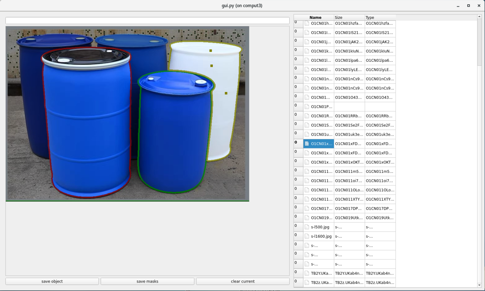
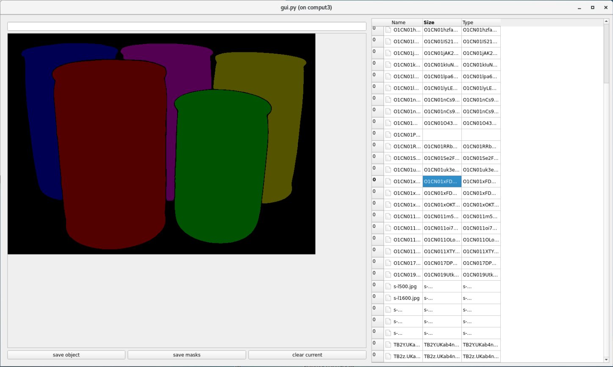
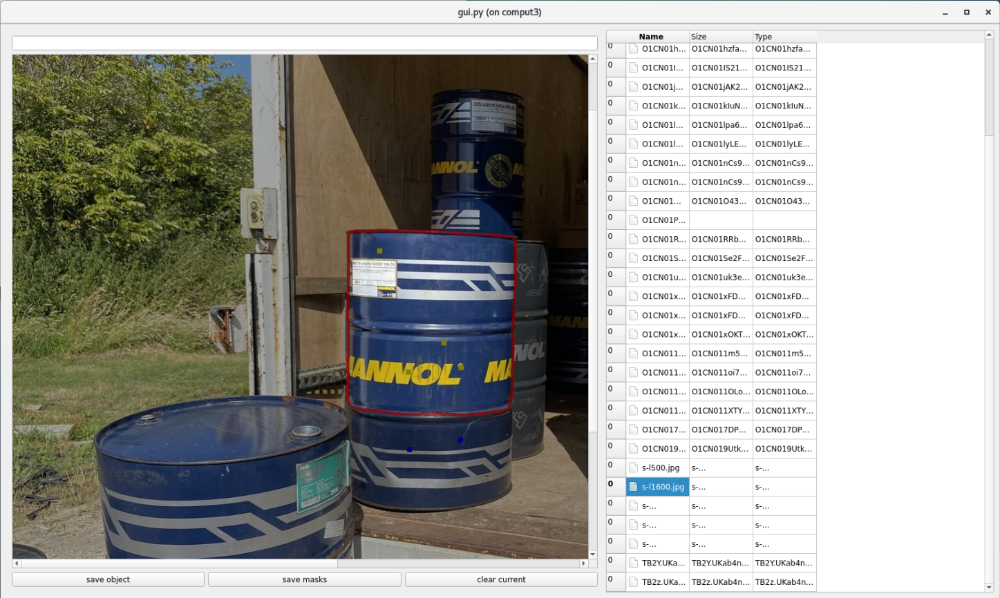

# SAM-Label

SAM-Label is an efficient tool developed to simplify the object annotation process. 
This tool utilizes the [Segment-Anything](https://github.com/facebookresearch/segment-anything) to automatically detect and annotate objects in images with just a few mouse clicks.






## Installation

### 1. Setup the environment for Segment-Anything

Follow the installation instruction in [README](README-Segment-Anything.md) and setup the environment.

### 2. Install PyQt and solve the environment conflict

```bash
pip install PyQt5 matplotlib
pip uninstall opencv-python
pip install opencv-python-headless
```

## Getting Started

### 1. Download Checkpoint

Follow the installation instruction in [README](README-Segment-Anything.md) and download the checkpoint.

### 2. Start the Program

```bash
python ./gui.py
```

Left mouse to add positive point (yellow point in image), Right mouse to add negative point (blue point in image).




## Acknowledgments
Our SAM-Label is built on top of [Segment-Anything](https://github.com/facebookresearch/segment-anything). 
We extend our gratitude for their remarkable contributions.
